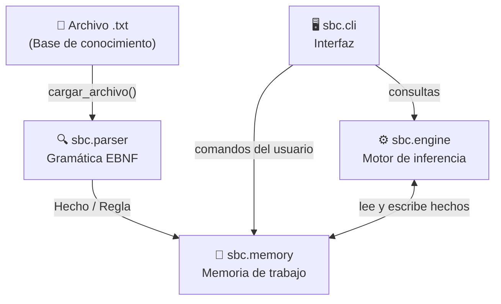

# Arquitectura del Sistema y Decisiones de Diseño

## Índice
1. [Visión general](#visión-general)
2. [Estructura de módulos](#estructura-de-módulos)
3. [Estructuras de datos](#estructuras-de-datos)
4. [Gramática de la base de conocimiento](#gramática-de-la-base-de-conocimiento)
5. [Módulo `sbc.parser`](#módulo-sbcparser)
6. [Módulo `sbc.memory`](#módulo-sbcmemory)
7. [Módulo `sbc.engine`](#módulo-sbcengine)
8. [Módulo `sbc.cli`](#módulo-sbccli)
9. [Algoritmos de inferencia](#algoritmos-de-inferencia)
10. [Propagación de incertidumbre](#propagación-de-incertidumbre)
11. [Decisiones de diseño](#decisiones-de-diseño)

---

## Visión general

Este sistema experto es un **motor de inferencia basado en reglas** con soporte para razonamiento hacia adelante (*forward chaining*), hacia atrás (*backward chaining*), restricciones aritméticas y lógica difusa. La representación del conocimiento se basa en **tripletas** `(sujeto, predicado, objeto)`.



---

## Estructura de módulos

| Módulo | Archivo | Responsabilidad |
|---|---|---|
| `sbc.parser` | `sbc/parser.py` | Gramática EBNF, tokenización, producción de dataclasses |
| `sbc.memory` | `sbc/memory.py` | Carga de ficheros, gestión del estado (hechos + reglas) |
| `sbc.engine` | `sbc/engine.py` | Unificación, forward chaining, backward chaining, restricciones |
| `sbc.cli` | `sbc/cli.py` | Bucle interactivo, formateo de resultados con `rich` |

---

## Estructuras de datos

Todas las entidades del dominio se representan con **dataclasses** de Python definidas en `sbc/parser.py`:

### `Tripleta`
Unidad mínima de conocimiento. Equivale a una afirmación atómica.
```
coronel_mostaza  ubicacion_crimen  biblioteca
└── sujeto ────┘  └── predicado ─┘  └── objeto ──┘
```
- Los términos que comienzan en **minúscula** son **literales**.
- Los términos que comienzan en **Mayúscula** son **variables**.

### `Hecho`
Tripleta con metadatos:
- `certeza: float` (0.0–1.0, por defecto 1.0) — grado de confianza en la afirmación.
- `negado: bool` — cuando es `True`, actúa como retractación de la tripleta en memoria.

### `Regla`
Regla de producción con forma `consecuente ← antecedentes`:
- `consecuente: Tripleta` — hecho a derivar.
- `antecedentes: List[Tripleta]` — condiciones (conjunción).
- `certeza: float` — factor multiplicador de la certeza derivada.
- `restricciones: List[Restriccion]` — filtros aritméticos sobre variables.
- `precedencia: int` (0–999) — orden de evaluación (mayor = antes).

### `Restriccion`
Filtro aritmético aplicado sobre una variable ligada durante la unificación:
```
   LlegaH       <=      2215
└─── var ──┘  └ op ┘  └ valor ┘
```
Operadores soportados: `<`, `<=`, `>`, `>=`, `=`.

### `Consulta`
Tripleta marcada como pregunta, con flag `razona_si` que distingue consulta directa (búsqueda en memoria) de demostración por encadenamiento hacia atrás.

---

## Gramática de la base de conocimiento

La gramática está implementada con `pyparsing`. A continuación su definición informal en EBNF:

```ebnf
archivo     ::= declaracion* EOF
declaracion ::= hecho | regla

hecho       ::= tripleta "." (extension)
              | "no" tripleta "."

regla       ::= tripleta "<-" tripleta ("," tripleta)* "." (extension)

tripleta    ::= termino termino termino
termino     ::= literal | variable
literal     ::= [a-z0-9] [a-zA-Z0-9_]*
variable    ::= [A-Z] [a-zA-Z0-9_]*

extension   ::= "[" extension_item (";" extension_item)* "]"
extension_item ::= precedencia | certeza | restriccion
precedencia ::= DIGIT DIGIT DIGIT          (* exactamente 3 dígitos, 000-999 *)
certeza     ::= "0." DIGIT+  |  "1"        (* número difuso en [0,1] *)
restriccion ::= variable operador entero
operador    ::= "<=" | ">=" | "<" | ">" | "="

consulta    ::= tripleta "?"
              | "razona si" tripleta "?"

comentario  ::= "#" .* EOL                 (* ignorado en cualquier posición *)
```

**Nota importante sobre la ambigüedad `precedencia` vs. `certeza`:** el token `100` podría leerse como el entero `1` seguido de `00`. Para evitar esto, el parser intenta `precedencia` (3 dígitos exactos) **antes** que `certeza` en la gramática.

---

## Módulo `sbc.parser`

El parser convierte texto plano en objetos Python mediante **acciones de parse** (`set_parse_action`). Cada elemento de la gramática está asociado a una función que construye el dataclass correspondiente:

```
"candelabro tiene_sangre si. [ 0.85 ]"
        ↓  (hecho_parser)
Hecho(tripleta=Tripleta("candelabro","tiene_sangre","si"), certeza=0.85)

"A es_arma_homicida crimen <- A coincide_herida crimen, A es_arma_vinculante crimen. [ 900; 0.95 ]"
        ↓  (reglas_parser)
Regla(consecuente=Tripleta("A","es_arma_homicida","crimen"),
      antecedentes=[Tripleta("A","coincide_herida","crimen"),
                    Tripleta("A","es_arma_vinculante","crimen")],
      certeza=0.95, precedencia=900)
```

Los tres parsers (`hecho_parser`, `reglas_parser`, `consulta_parser`) son exportados y reutilizados por `sbc.memory` y `sbc.cli`.

---

## Módulo `sbc.memory`

Gestiona el **estado mutable** del sistema durante la ejecución:

- **Carga de archivos:** `cargar_archivo(ruta)` — lee UTF-8, parsea y acumula hechos y reglas de múltiples archivos sin limpiar la memoria previa.
- **Aserción de hechos:** `agregar_hecho(hecho)` — inserta si es nuevo; actualiza la certeza si llega una certeza **mayor** (la memoria nunca degrada la certeza de un hecho conocido). Los hechos con `negado=True` **eliminan** la tripleta coincidente.
- **Registro de reglas:** `agregar_regla(regla)` — deduplicación por `(consecuente, antecedentes)`; el array `reglas` se **reordena por precedencia descendente** en cada inserción, garantizando que el motor siempre evalúe primero las reglas de mayor prioridad.

---

## Módulo `sbc.engine`

### Unificación

`unificar(patron, hecho, sust_previa) → Sustitucion | None`

Compara posición a posición los tres campos de dos tripletas:
- **Variable libre:** se enlaza al literal del hecho (`sust[var] = literal`).
- **Variable ligada:** se verifica coherencia; si el valor no coincide, falla (`return None`).
- **Literal:** igualdad estricta; si no coinciden, falla.

`_resolver(termino, sust)` sigue cadenas de sustitución (`P → X → coronel_mostaza`) con detección de ciclos mediante un conjunto de `visitados`, evitando bucles infinitos.

### Forward Chaining

```
mientras hay cambios:
    para cada regla (en orden de precedencia):
        para cada combinación de hechos que unifica los antecedentes:
            evaluar restricciones aritméticas
            calcular certeza = min(certezas_antecedentes) × certeza_regla
            si el consecuente no existe → añadir hecho
            si existe con certeza menor → actualizar certeza
            marcar cambio = True
```

El bucle termina cuando ninguna regla produce hechos nuevos ni actualiza certezas. El motor nunca degrada una certeza ya existente.

### Backward Chaining

```
demostrar(objetivo, nivel):
    1. Buscar en memoria: si hay hecho que unifica → yield (sust, certeza)
    2. Para cada regla cuyo consecuente unifique con objetivo:
       a. Intentar demostrar cada antecedente recursivamente
       b. Acumular mínimo de certezas
       c. yield (sust_limpia, min_antecedentes × certeza_regla)
    3. Si nivel > 15 → terminar (prevención de recursión infinita)
```

El backward chaining produce resultados bajo demanda sin precomputar el árbol completo. La "limpieza de colisiones" al final de cada derivación filtra la sustitución para devolver solo las variables que el usuario especificó en su consulta original.

---

## Módulo `sbc.cli`

Bucle REPL construido con `click` (punto de entrada) y `rich` (salida formateada con color). El parser combinado `hecho_parser | reglas_parser | consulta_parser` intenta clasificar cada línea de entrada:

1. Si es un `Hecho` → asertar/revocar en memoria.
2. Si es una `Regla` → registrar en memoria.
3. Si es una `Consulta` con `razona_si=False` → llamar a `consultar_hechos()`.
4. Si es una `Consulta` con `razona_si=True` → llamar a `encadenamiento_hacia_atras()`.
5. Si es un comando `!` → ejecutar acción de sistema.
6. Si falla el parse → mostrar sugerencia de sintaxis.


---

## Propagación de incertidumbre

El sistema implementa **lógica difusa** con la T-norma mínimo y producto escalado:

$$\text{certeza\_derivada} = \min(c_1, c_2, \ldots, c_n) \times \text{certeza\_regla}$$

Donde $c_i$ son las certezas de los hechos antecedentes. Ejemplo de la KB de Cluedo:

| Paso | Cálculo | Resultado |
|---|---|---|
| `candelabro es_arma_vinculante` | $\min(0.85, 0.90) \times 0.95$ | **0.81** |
| `candelabro coincide_herida` | $\min(0.90, 1.00) \times 1.00$ | **0.90** |
| `candelabro es_arma_homicida` | $\min(0.90, 0.81) \times 0.95$ | **0.77** |
| `coronel_mostaza vinculado` | $\min(0.88, 0.77) \times 0.90$ | **0.69** |
| `coronel_mostaza es_sospechoso` | $\min(1.0, 0.90, 1.0) \times 0.60$ | **0.54** |
| `coronel_mostaza es_sospechoso_fuerte` | $\min(0.54, 0.69, 1.0) \times 0.90$ | **0.49** |
| `coronel_mostaza es_culpable` | $\min(0.49, 0.90) \times 0.95$ | **0.46** |

---

## Decisiones de diseño

### 1. Anti-colisión de variables en backward chaining

**Problema:** al unificar el consecuente de una regla con el objetivo, las variables de la regla y del objetivo comparten el mismo espacio de nombres. Si la regla tiene `P es_culpable crimen` y la consulta es `coronel_mostaza es_culpable crimen`, la variable `P` de la regla debe vincularse al literal `coronel_mostaza` sin contaminar otras variables.

**Solución:** la unificación en backward chaining invierte el orden de argumentos respecto al forward chaining (`unificar(regla.consecuente, objetivo, {})` en lugar de al revés). Al finalizar cada derivación, se filtra la sustitución para devolver **únicamente** las variables presentes en la consulta original.

### 2. Precedencia de reglas (000-999)

Las reglas de mayor precedencia se evalúan primero. Esto permite:
- **999:** descartes inmediatos (inocentes con coartada, imposibles lógicos).
- **900:** evidencia objetiva fuerte (vinculación física, arma homicida).
- **800:** veredicto principal (culpable con testigo).
- **500:** sospechoso fuerte.
- **200:** sospechoso débil (primer nivel de la jerarquía).
- **0 (defecto):** reglas auxiliares sin orden crítico.

La memoria mantiene las reglas **ordenadas por precedencia descendente** en todo momento, garantizando que el motor forward chaining siempre las evalúe en el orden correcto.

### 3. Certeza solo crece (monotonía positiva)

Cuando el motor deriva un hecho que ya existe en memoria, **solo actualiza la certeza si la nueva es mayor**. Esto garantiza que la certeza refleja el camino de razonamiento más fuerte encontrado hasta el momento y evita que rutas de baja calidad degraden conclusiones sólidas.

### 4. Prevención de Bucles y Recursividad
Se detectó que la regla transitiva de accesibilidad llamaba a su propio consecuente (`es_accesible_desde <- es_accesible_desde`), colgando el encadenamiento hacia atrás en un bucle infinito.
Para solucionarlo, se refactorizó la regla obligando al motor a apoyarse estrictamente en los hechos base inmutables del mapa (`H conecta_con I, I conecta_con G`).
Este ajuste rompe el ciclo ciego de auto-llamadas, garantizando que el árbol de búsqueda de la IA se resuelva de forma instantánea sin sacrificar la lógica espacial.

### 5. Tripletas como representación universal

La elección de tripletas `(sujeto, predicado, objeto)` como unidad atómica permite representar tanto:
- **Hechos cualitativos:** `coronel_mostaza tiene_caracter impulsivo.`
- **Hechos numéricos:** `candelabro peso_gramos 1800.`
- **Relaciones binarias:** `biblioteca conecta_con pasillo.`
- **Estado del proceso:** `P es_culpable crimen.`

Sin necesidad de estructuras de datos especializadas por tipo de información.
